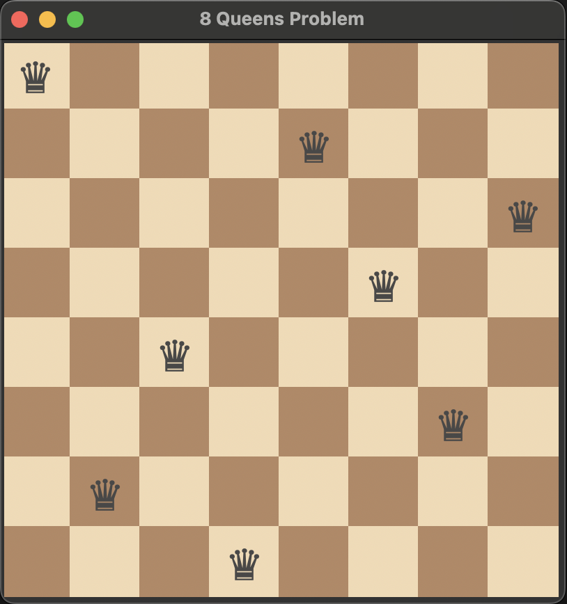

# 8 Queens Problem

Place 8 queens in such a manner on an 8 x 8 chessboard that no queens attack each other by being in the same row, column or diagonal

## Solution

I have solved the 8 Queens Problem using Python implementing a backtracking algorithm. `8QueensProblem.py` contains the implementation of this solution.

## Video Demonstration

Click on the thumbnail above to watch the video demonstration of the solution to the 8 Queens Problem.

## Usage

You can run the `8QueensProblem.py` script to see the solution in action. Additionally, you can refer to the video and the picture for further understanding and visualization of the solution.